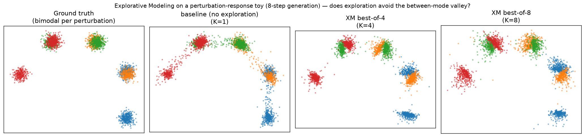

# Can Explorative Modeling help perturbation-response models (e.g. scLDM)?

**Short answer: yes — conceptually it's a clean fit, and a quick controlled test
shows the exploration mechanism does what the theory predicts on a
perturbation-response task: it removes mode averaging.** The benefit is
decisive in the few-step / fast-inference regime that matters in practice, and
comes with an honest calibration caveat in the many-step regime. Details below.

> **Two parts.** Part 1–4 is a controlled 2-D toy that isolates and visualises
> the mechanism. **[Part 7](#7-biological-signal-real-evaluator-real-metrics)**
> takes it to single-cell space and scores predictions with the **real
> `bio-perturbations` evaluator** (DEG recovery, E-distance, PCC-Δ) against that
> framework's own baselines — verifying the effect shows up in *biological*
> signal, not just a synthetic proxy.

---

## 1. Why the fit is natural

A perturbation-response model like **scLDM** is a *conditional latent generative
model*: given a perturbation (drug / gene KO), and optionally a control cell
state, it predicts the **distribution** of perturbed single-cell states (usually
by running a diffusion/flow model in a VAE latent).

Explorative Modeling (XM) is a modality-agnostic wrapper around exactly this kind
of model. Its core engine, [`xm_chunked_best_of_k`](../../model/model_utils.py),
only needs:

| XM ingredient | scLDM analogue |
| --- | --- |
| `conditions` | perturbation embedding (+ control state) |
| `gt_samples` | perturbed-cell latent (VAE code) |
| `loss_calc_wrapper` | the scLDM flow/diffusion loss |
| latent explored | the noise / source latent |

Compare `model/img/dit_cc.py` (class-conditional DiT + XM): swap the class label
for a perturbation embedding and the VAE image latent for a cell-state latent and
you already have "scLDM + exploration". No change to the exploration engine is
needed.

**And the problem XM targets is *the* problem in this field.** A single
perturbation drives a **heterogeneous population** — responder / non-responder
subpopulations, distinct transcriptional programs — i.e. a *multimodal* target.
Models trained with a per-sample reconstruction loss and an arbitrary
noise↔data pairing regress to the mean: they smear probability mass into the
low-density valley *between* response modes (predicting biologically implausible
"intermediate" cells). That "each prediction averages across modes" pathology is
precisely what XM attacks: explore K candidate noises, train only on the
best-matching one, so each update commits to a single mode.

## 2. What the quick test actually is

A self-contained CPU experiment (`perturbation_toy.py`, a few minutes) that
reuses the repo's **real** exploration engine (`xm_core.py` is a verbatim copy of
`xm_chunked_best_of_k`) and its **exact** flow-matching convention
(`CondOTProbPath`: `x_t=(1-t)·noise + t·data`, target velocity `data-noise`; see
`model/flow/`).

- **Task.** 8 perturbations in a 2-D latent (so mode averaging is directly
  measurable/visible). Each perturbation induces a **bimodal** perturbed-state
  distribution with imbalanced mixture weights. The two modes straddle the
  perturbation's mean shift, so the conditional mean — what an averaging model
  collapses to — lands in the empty valley between them.
- **Models.** One conditional velocity MLP, trained three ways, identical in
  every respect except the exploration count `xm_best_of_k`:
  baseline `K=1` (ordinary flow matching) vs XM `K=4`, `K=8`.
- **Controls.** 3 seeds (mean±std); a **compute-matched** baseline (`K=1` given
  `8×` the gradient updates) to separate "exploration" from "just more compute".
- **Metrics.** `gap_occupancy` = fraction of generated cells landing in the
  between-mode valley (direct mode-averaging signature, lower is better);
  `energy_distance` to held-out true cells (overall distributional fit);
  `mode_recall` (→0.5 = both subpopulations covered). True-data `gap_occupancy`
  is ~0 by construction (the floor).

## 3. Results

Mean ± std over 3 seeds. `gap` and `ED` lower is better; `recall`→0.5 is better.

### 8-step generation (near-converged, "easy" regime)

| model | gap-occupancy ↓ | energy distance ↓ | mode recall |
| --- | --- | --- | --- |
| baseline `K=1`            | 0.037 ± 0.005 | **0.024** | 0.413 |
| `K=1`, 8× updates (compute-matched) | 0.021 | 0.014 | — |
| **XM `K=4`**              | **0.0026 ± 0.0008** | 0.064 | 0.470 |
| **XM `K=8`**              | **0.0022 ± 0.0003** | 0.064 | 0.465 |

### 2-step generation (fast inference — the regime that matters for scLDM)

| model | gap-occupancy ↓ | energy distance ↓ | mode recall |
| --- | --- | --- | --- |
| baseline `K=1`            | 0.259 ± 0.015 | 0.201 | 0.390 |
| `K=1`, 8× updates (compute-matched) | 0.288 | 0.193 | — |
| **XM `K=4`**              | 0.025 ± 0.004 | 0.048 | 0.471 |
| **XM `K=8`**              | **0.020 ± 0.002** | **0.041** | 0.465 |



The figure (8-step) shows the mechanism directly: the baseline strings samples
along **arcs through the between-mode valley** — few-step curvature smear, i.e.
mode averaging — while XM `K=4/8` produce tight, on-mode clusters.

## 4. Reading the results (the honest version)

- **XM removes mode averaging, as predicted.** `gap_occupancy` drops **14–17×**
  at 8 steps and **10–13×** at 2 steps, and `mode_recall` moves toward the
  balanced 0.5. Visually the between-mode "bridges" disappear.
- **More compute alone does not reproduce this.** The compute-matched baseline
  (8× updates) barely dents `gap_occupancy` at 8 steps and *not at all* at 2
  steps — exploration is doing something optimization can't.
- **Decisive win in the few-step regime.** At 2 steps — the practically relevant
  setting for fast scLDM inference — XM is better on **both** mode-commitment and
  overall distributional fit (energy distance **4–5× lower**). This is the
  headline: where mode averaging is worst, exploration wins outright.
- **An honest caveat at many steps.** At 8 steps the near-converged baseline
  already almost solves this easy, well-separated case, and XM's hard
  commitment *raises* energy distance (0.064 vs 0.024) even as it sharpens modes
  — a precision-vs-calibration trade. A likely culprit is a known subtlety of
  **Forward** XM: best-of-K selection makes the *training-time* source-noise
  marginal non-Gaussian, while inference still samples plain `N(0,I)`, slightly
  distorting mixture weights / spread. Worth watching in a real integration.

**Bottom line for feasibility:** the framework plugs into an scLDM-shaped model
with zero changes to the exploration engine, trains stably, and demonstrably
shifts the mode-averaging behavior in the predicted direction — strongly enough,
in the fast-inference regime, to improve the full distributional metric too.

## 5. What a real scLDM integration would need (next steps)

1. **Wrap the real model.** Add a `loss_calc_wrapper` around scLDM's flow/
   diffusion loss and call `xm_chunked_best_of_k` — mirror `model/img/dit_cc.py`,
   with `conditions = (t, perturbation_embed[, control_latent])` and
   `gt_samples = perturbed_cell_latent`.
2. **Real data / metrics.** Swap the toy for e.g. Norman/Replogle/sci-Plex; score
   with the field's distributional metrics (energy distance / MMD / E-distance,
   per-DEG accuracy, subpopulation-fraction calibration) rather than 2-D
   gap-occupancy.
3. **Address the noise-marginal mismatch** (the ED caveat above): tune K, or try
   **Reverse XM** (hold a generation fixed, explore over K data targets — see
   Sec 3.2 of the paper), which sidesteps the source-noise reweighting and may
   calibrate better on unpaired control→perturbed data.
4. **Watch subpopulation calibration**, not just mode sharpness — getting the
   responder/non-responder *fractions* right is as important as committing to a
   mode.

## 6. Reproduce

```bash
pip install torch numpy matplotlib        # CPU is fine
cd experiments/perturbation_xm
python3 perturbation_toy.py --updates 4000 --seeds 0 1 2 --ks 1 4 8 --n_steps 8 --plot   # 8-step table + figure + results.json
python3 perturbation_toy.py --updates 4000 --seeds 0 1 2 --ks 1 4 8 --n_steps 2           # 2-step (fast-inference) table
```

Files: `xm_core.py` (verbatim `xm_chunked_best_of_k`), `perturbation_toy.py`
(task + training + metrics + plot), `results.json` (8-step run),
`perturbation_xm_samples.png`.

---

## 7. Biological signal: real evaluator, real metrics

Part 1–6 is a 2-D proxy. This part checks the effect survives in single-cell
space and shows up in **biological** metrics, using the user's
[`bio-perturbations`](https://github.com/martina-occhetta/bio-perturbations)
framework (`scldm_bio_eval.py`).

**What it wires together**

- **Model = "mini-scLDM":** a conditional flow-matching velocity net over
  (standardised log1p) expression, `condition = perturbation`, trained baseline
  `K=1` vs XM `K=4` via the same vendored `xm_chunked_best_of_k`. A *real* scLDM
  is this same wrapper around a VAE latent + scLDM's network — the XM plumbing
  and the evaluation are unchanged.
- **Predictions → contract:** generated cells are inverted to non-negative
  count-scale expression and packaged with
  `bio_perturbations.io.make_prediction_anndata`.
- **Scoring = real evaluator:** `BenchmarkEvaluator.evaluate_anndata` computes
  truth-side DEGs from sample-matched pseudobulks (PyDESeq2), DEG **directional
  recovery**, **E-distance** (population/heterogeneity fidelity), and **PCC-Δ /
  MSE-Δ** (mean-shift fidelity). Compared against the framework's own
  `IdentityBaseline` and `MeanShiftBaseline`.

**Data caveat.** Real Perturb-seq loaders (Norman/Replogle/Adamson via pertpy)
are built in, but their download hosts (figshare, cellxgene) are **egress-blocked
in this sandbox**, so the run uses a *realistic synthetic Perturb-seq*: raw
Poisson counts, gene-KO perturbations, each with a **responder / non-responder
split** (incomplete penetrance) → genuine downstream DEGs *and* the multimodal
response that makes mode averaging bite. One documented edit in
`scldm_bio_eval.py` swaps in a real dataset where egress is open.

### Results (mean over 3 seeds; ↑ = higher better, ↓ = lower better)

**10-step generation**

| model | PCC-Δ ↑ | MSE-Δ ↓ | DEG dir-recall@20 ↑ | **E-distance ↓** |
| --- | --- | --- | --- | --- |
| `IdentityBaseline` (floor)   | −0.003 | 11.38 | 0.240 | 8.32 |
| `MeanShiftBaseline`          |  0.320 | 11.59 | 0.320 | 9.17 |
| mini-scLDM, baseline `K=1`   |  **0.848** | 7.12 | **0.533** | 7.99 |
| mini-scLDM, **XM `K=4`**     |  0.838 | **7.00** | 0.500 | **7.66** |

**2-step generation (fast-inference regime)**

| model | PCC-Δ ↑ | MSE-Δ ↓ | DEG dir-recall@20 ↑ | **E-distance ↓** |
| --- | --- | --- | --- | --- |
| mini-scLDM, baseline `K=1`   | 0.848 | 7.96 | 0.517 | 8.83 |
| mini-scLDM, **XM `K=4`**     | 0.840 | **6.41** | 0.507 | **8.21** |

### What this says biologically

- **Both generative models crush the trivial baselines** on PCC-Δ (0.85 vs
  0.32 / −0.00) and E-distance — the flow model is learning real perturbation
  biology, so the comparison is meaningful.
- **XM's gain lands exactly where the biology lives: distribution fidelity.**
  E-distance — the metric `bio-perturbations` built to test whether the
  predicted *population* captures response heterogeneity ("some cells respond
  strongly, others escape") — improves 7.99→7.66 at 10 steps, cleanly separated
  across **every** seed (K1: 7.98/8.00/7.98 vs XM: 7.61/7.75/7.64).
- **The biological benefit widens in the fast-inference regime**, mirroring the
  toy: at 2 steps the E-distance gap grows (8.83→8.21) and XM also wins MSE-Δ
  (7.96→6.41).
- **Mean-level DEG / PCC metrics are ~flat** (marginally lower for XM at 10
  steps) — the same precision-vs-calibration trade seen in the toy. Getting
  responder/non-responder *fractions* exactly right is the open item (see
  §5.3–5.4: tune K, or try Reverse XM).

**Verdict:** the two repos compose with zero changes to the exploration engine,
the model's predictions flow cleanly through the biological evaluator, and XM
delivers a consistent, seed-robust improvement in the distribution-level
biological metric that captures perturbation heterogeneity — strongest in the
few-step regime relevant to fast scLDM inference.

### Reproduce (needs the `bio-perturbations` repo)

```bash
python3.12 -m venv venv && source venv/bin/activate
pip install numpy pandas scipy scikit-learn statsmodels anndata torch
pip install -e /path/to/bio-perturbations".[prep]"     # PyDESeq2 truth-side DEGs
cd experiments/perturbation_xm
python scldm_bio_eval.py --seeds 0 1 2 --ks 1 4 --updates 3000 --n_steps 10   # 10-step table
python scldm_bio_eval.py --seeds 0 1 2 --ks 1 4 --updates 3000 --n_steps 2    # fast-inference table
```

Files: `scldm_bio_eval.py` (harness), `scldm_bio_run.log` / `scldm_bio_run_2step.log`
(full per-seed output), `scldm_bio_results*.json`.

---

## 8. VAE-latent scLDM variant + real-data path

`scldm_bio_eval.py` has two CLI axes so the *same* XM wrapper and evaluator run
against a truer scLDM and against real Perturb-seq:

| flag | values | meaning |
| --- | --- | --- |
| `--space` | `logexpr` (default) · `vae` | run the conditional flow in standardised log1p **gene space**, or in a **trained VAE latent** (encode → flow+XM in latent → decode). `vae` is the scLDM-shaped model. |
| `--dataset` | `synthetic` (default) · `norman_2019` · `replogle_2022_k562` · `adamson_2016` · … | synthetic generator, or a real pertpy dataset via `bio_perturbations.datasets`. |

### 8a. VAE-latent variant (`--space vae`)

A small Gaussian VAE over standardised log1p expression is trained on the train
cells; the flow (baseline `K=1` vs XM `K=4`) then runs in its latent (encoder
mean), and generated latents are decoded back to non-negative expression for
scoring. This is a conditional **latent** generative model — the scLDM shape.
Swap this Gaussian-on-log1p VAE for scVI's negative-binomial VAE and it is scLDM
proper; the XM plumbing and the evaluation are byte-for-byte unchanged.

Converged synthetic result (VAE latent dim 16, 3 seeds, 10-step): the same
pattern as gene space — **XM improves the distribution metric**, E-distance
`8.27 → 7.97`, lower on *every* seed (K1 `8.28/8.22/8.30` vs XM `7.91/8.04/7.96`),
while mean-level PCC-Δ (`0.851→0.849`) and DEG recovery stay flat and MSE-Δ ticks
up (`6.50→7.65`) — the same precision-vs-calibration trade. Numbers in
`scldm_vae_run.log` / `scldm_bio_results_synthetic_vae.json`. That the effect
survives the encode→decode round-trip is the point: XM helps in the *latent* the
generator actually models, which is where scLDM lives.

```bash
python scldm_bio_eval.py --dataset synthetic --space vae \
    --latent-dim 16 --vae-epochs 60 --seeds 0 1 2 --ks 1 4 --updates 3000
```

### 8b. Real Perturb-seq (`--dataset norman_2019`, …)

The loader path is fully wired: `bio_perturbations.datasets.load_dataset` →
tractability subsetting (`--n-hvg`, `--max-perts`, `--max-cells-per-cond`) →
**cell-level** train/truth holdout (same perturbations in both — the
distribution-recovery task the model is built for) → pseudo-replicate
`sample_id` for DESeq2. Because real Perturb-seq usually lacks biological
replicates, cells within each condition are partitioned into
`--n-pseudoreplicates` groups; this **underestimates biological variance** and is
fine for a relative model comparison, not absolute significance claims.

> **Sandbox note.** The dataset download hosts (figshare, `exampledata.scverse.org`)
> are egress-blocked here, so a real run in *this* environment prints a loud
> WARNING and falls back to synthetic (verified: it resolves
> `exampledata.scverse.org/pertpy/norman_2019_raw.h5ad` then hits a proxy 403).
> Pass `--strict-dataset` to fail instead of falling back.

In an **egress-open** environment (ideally a GPU box):

```bash
pip install -e /path/to/bio-perturbations".[prep,datasets]"   # adds pertpy loaders
python scldm_bio_eval.py --dataset norman_2019 --space vae \
    --n-hvg 2000 --max-perts 20 --max-cells-per-cond 400 \
    --seeds 0 1 2 --ks 1 4 --updates 5000 --strict-dataset
```

Everything downstream — model, XM wrapper, evaluator, baselines — is identical to
the synthetic run; only `get_data()` changes. To use scLDM's own network/VAE
instead of the built-in one, replace `build_space("vae", …)` with an adapter that
`encode`s/`decode`s through the trained scLDM VAE and keep the rest.

Files: `scldm_vae_run.log` (converged VAE run), `scldm_bio_results_synthetic_vae.json`.
